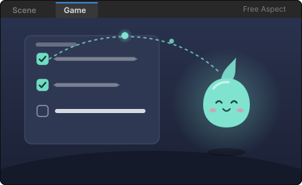
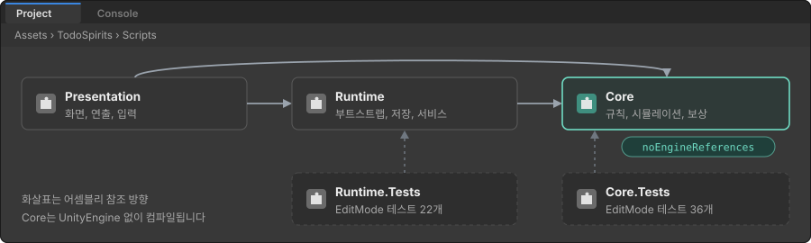
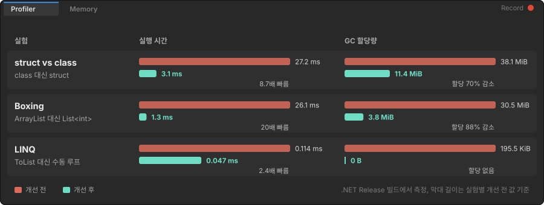
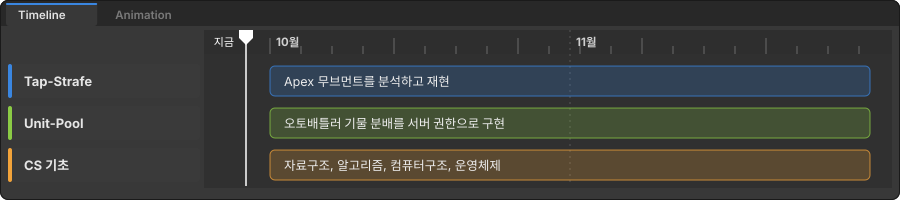

<p>
  <a href="https://velog.io/@w_wgeon"></a>&nbsp;
  <a href="mailto:wegeon.dev@gmail.com"></a>
</p>

Unity와 C#으로 게임 클라이언트를 만듭니다. 게임 규칙은 엔진에서 떼어내 테스트하고, 성능은 감이 아니라 측정한 숫자로 판단합니다.

<br>


### Todo with Spirits

<table>
<tr>
<td width="46%" valign="top"></td>
<td valign="top">

할 일을 완료하면 정수가 모이고, 정령이 자라며 하루를 살아가는 TODO 앱의 **Unity 파트**입니다.

<sub>4인 팀(Android, Backend, Web, Unity)에서 Unity 파트 단독 설계와 구현<br>2026.06부터 진행 중</sub>

**엔진 독립 도메인**<br>게임 규칙을 담은 Core를 `noEngineReferences` 어셈블리로 분리해 UnityEngine 없이 컴파일하고 테스트합니다.

**결정적 시뮬레이션**<br>하루를 만드는 입력 전체를 FNV-1a로 해시해 시드로 쓰기 때문에, 같은 입력이면 언제나 같은 하루가 나옵니다.

**테스트 58개**<br>성장 규칙, 보상 계산, 하루 생성, 저장과 복원을 EditMode 테스트로 검증합니다.

</td>
</tr>
</table>



| 보고 싶은 것 | 바로 가기 |
| :-- | :-- |
| 하루를 만드는 로직 | [`SpiritDayGenerator.cs`](https://github.com/junsu1023/todo-with-spirits/blob/develop/unity/TodoSpirits/Assets/TodoSpirits/Scripts/Core/Simulation/SpiritDayGenerator.cs#L64-L65) |
| 환경과 무관한 시드 해시 | [`StableHash.cs`](https://github.com/junsu1023/todo-with-spirits/blob/develop/unity/TodoSpirits/Assets/TodoSpirits/Scripts/Core/Simulation/StableHash.cs) |
| 정령 성장 규칙 | [`CompanionLifeRules.cs`](https://github.com/junsu1023/todo-with-spirits/blob/develop/unity/TodoSpirits/Assets/TodoSpirits/Scripts/Core/Simulation/CompanionLifeRules.cs) |
| 저장소 인터페이스와 JSON 구현 | [`JsonSpiritSaveRepository.cs`](https://github.com/junsu1023/todo-with-spirits/blob/develop/unity/TodoSpirits/Assets/TodoSpirits/Scripts/Runtime/Persistence/JsonSpiritSaveRepository.cs) |
| 테스트 전체 | [`Tests/`](https://github.com/junsu1023/todo-with-spirits/tree/develop/unity/TodoSpirits/Assets/TodoSpirits/Tests) |
| 내가 쓴 커밋 | [commits by WI-GEON](https://github.com/junsu1023/todo-with-spirits/commits/develop/?author=WI-GEON) |

<details>
<summary><b>코드 미리보기</b>: 같은 입력이면 같은 하루가 나오는 이유</summary>
<br>

```csharp
// SpiritDayGenerator.cs: 하루를 만드는 모든 입력을 정규화한 뒤 시드로 변환
var seed = StableHash.ToSignedSeed(
    BuildCanonicalSeedInput(date, taskList, classificationList, spiritState, version));

// StableHash.cs: 실행 환경마다 값이 달라질 수 있는 string.GetHashCode() 대신 FNV-1a 사용
public static uint Fnv1A(string value)
{
    var hash = FnvOffsetBasis;
    var bytes = Encoding.UTF8.GetBytes(value ?? string.Empty);

    for (var i = 0; i < bytes.Length; i++)
    {
        hash ^= bytes[i];
        hash *= FnvPrime;
    }

    return hash;
}
```

</details>

<br>

### AllocLab

Unity에서 GC 스파이크를 만드는 C# 코드 패턴을 직접 측정한 개인 실험입니다.

는 ArrayList보다 20배, 수동 루프는 LINQ보다 2.4배 빠름">

| 보고 싶은 것 | 바로 가기 |
| :-- | :-- |
| 실험 코드 | [`StructClassExperiment.cs`](https://github.com/WI-GEON/system-playground/blob/main/csharp/week01/AllocLab/Experiments/StructClassExperiment.cs), [`BoxingExperiment.cs`](https://github.com/WI-GEON/system-playground/blob/main/csharp/week01/AllocLab/Experiments/BoxingExperiment.cs), [`LinqExperiment.cs`](https://github.com/WI-GEON/system-playground/blob/main/csharp/week01/AllocLab/Experiments/LinqExperiment.cs) |
| 측정 도구 | [`Benchmarks/`](https://github.com/WI-GEON/system-playground/tree/main/csharp/week01/AllocLab/Benchmarks) |
| 실험 리포트 | [`Docs/`](https://github.com/WI-GEON/system-playground/tree/main/csharp/week01/AllocLab/Docs) |

<br>

### CodingTest

C#으로 푼 알고리즘 문제 기록입니다. solved.ac 25문제, [`Problems/`](https://github.com/WI-GEON/CodingTest/tree/main/Problems/SolvedAc)

<br>


<p>
  
</p>

| 영역 | 할 수 있는 것 | 근거 |
| :-- | :-- | :-- |
| **Unity 구조 설계** | 어셈블리로 계층을 나누고 인터페이스로 의존성을 끊습니다 | [Todo with Spirits](#todo-with-spirits) |
| **테스트** | Unity Test Framework로 도메인과 저장 로직을 검증합니다 | [Tests/](https://github.com/junsu1023/todo-with-spirits/tree/develop/unity/TodoSpirits/Assets/TodoSpirits/Tests) |
| **성능과 메모리** | 할당과 GC를 측정하고 박싱, LINQ 할당을 피합니다 | [AllocLab](#alloclab) |
| **협업** | develop, feature 브랜치 전략과 Conventional Commits로 4인 팀과 작업했습니다 | [커밋 기록](https://github.com/junsu1023/todo-with-spirits/commits/develop/?author=WI-GEON) |

<sub>Unity 6, 2022.3 LTS &nbsp;&nbsp;|&nbsp;&nbsp; C# &nbsp;&nbsp;|&nbsp;&nbsp; Rider, Visual Studio &nbsp;&nbsp;|&nbsp;&nbsp; Git, GitHub, Jira, Confluence, Notion</sub>

<br>




<br>


<!-- Velog 최신 글이 GitHub Actions로 자동 갱신됩니다 -->
<!-- BLOG-POST-LIST:START -->
- [[VS] 참조 표시 제거](https://velog.io/@w_wgeon/VS-%EC%B0%B8%EC%A1%B0-%ED%91%9C%EC%8B%9C-%EC%A0%9C%EA%B1%B0)
- [오버플로우와 언더플로우 &lpar;Overflow &amp; Underflow&rpar;](https://velog.io/@w_wgeon/OverflowUnderflow)
- [박싱과 언박싱 &lpar;Boxing &amp; Unboxing&rpar;](https://velog.io/@w_wgeon/BoxingUnboxing)
- [🎮 Game Start!](https://velog.io/@w_wgeon/%EA%B2%8C%EC%9E%84-%EA%B0%9C%EB%B0%9C%EC%9E%90%EB%A1%9C%EC%84%9C%EC%9D%98-%EC%83%88%EB%A1%9C%EC%9A%B4-%EC%8B%9C%EC%9E%91)
<!-- BLOG-POST-LIST:END -->

<br>


<picture>
  <source media="(prefers-color-scheme: dark)" srcset="https://raw.githubusercontent.com/WI-GEON/WI-GEON/output/snake-dark.svg">
  
</picture>

<br><br>

<sub>실무 프로젝트는 계약상 비공개입니다. 포트폴리오는 요청 시 전달드립니다.</sub>
