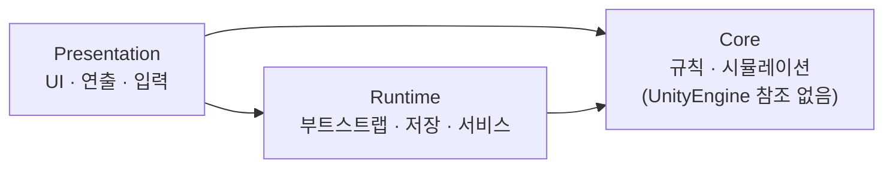

# 위건 &nbsp;<sub><sup>WI-GEON</sup></sub>

**Unity / C# 게임 클라이언트 개발자**입니다.  
게임 규칙과 엔진 코드를 분리해 테스트할 수 있게 만들고, 성능은 감이 아니라 측정으로 확인합니다.

[Velog](https://velog.io/@w_wgeon) · [Email](mailto:wegeon.dev@gmail.com) · 포트폴리오는 요청 시 전달드립니다

<sub>[Projects](#projects) · [Skills](#skills) · [Next](#next) · [Writing](#writing)</sub>

<br>

## Projects

### Todo with Spirits
할 일을 완료하면 정령이 자라고 생활하는 TODO 앱의 **Unity 파트**  
<sub>4인 팀 (Android · Backend · Web · Unity) 중 Unity 파트 단독 설계 · 구현 &nbsp;|&nbsp; 2026.06 – &nbsp;|&nbsp; `Unity 6` `C#` `Assembly Definition` `Unity Test Framework`</sub>

- **엔진 독립 도메인** — 게임 규칙(Core)을 `noEngineReferences` asmdef로 분리해 UnityEngine 없이 컴파일 · 테스트
- **결정적 시뮬레이션** — 날짜 · 할 일 · 정령 상태 · 시뮬레이션 버전을 FNV-1a로 해시해 시드로 사용, 같은 입력이면 항상 같은 하루 생성
- **저장소 추상화** — `ISpiritSaveRepository` 뒤에 JSON 저장 구현을 두어 저장 방식 교체 가능
- **테스트 58개** — 성장 규칙 · 보상 계산 · 하루 생성 · 저장/복원을 EditMode 테스트로 검증



| 보고 싶은 것 | 코드 |
| :-- | :-- |
| 하루 생성 로직 | [`SpiritDayGenerator.cs`](https://github.com/junsu1023/todo-with-spirits/blob/develop/unity/TodoSpirits/Assets/TodoSpirits/Scripts/Core/Simulation/SpiritDayGenerator.cs#L64-L65) |
| 결정적 시드 해시 | [`StableHash.cs`](https://github.com/junsu1023/todo-with-spirits/blob/develop/unity/TodoSpirits/Assets/TodoSpirits/Scripts/Core/Simulation/StableHash.cs) |
| 정령 성장 규칙 | [`CompanionLifeRules.cs`](https://github.com/junsu1023/todo-with-spirits/blob/develop/unity/TodoSpirits/Assets/TodoSpirits/Scripts/Core/Simulation/CompanionLifeRules.cs) |
| 저장 구현 | [`JsonSpiritSaveRepository.cs`](https://github.com/junsu1023/todo-with-spirits/blob/develop/unity/TodoSpirits/Assets/TodoSpirits/Scripts/Runtime/Persistence/JsonSpiritSaveRepository.cs) |
| 테스트 | [`Tests/`](https://github.com/junsu1023/todo-with-spirits/tree/develop/unity/TodoSpirits/Assets/TodoSpirits/Tests) |
| 내 커밋 기록 | [commits by WI-GEON](https://github.com/junsu1023/todo-with-spirits/commits/develop/?author=WI-GEON) |

<details>
<summary>코드 미리보기 — 같은 입력이면 같은 결과가 나오는 이유</summary>
<br>

```csharp
// SpiritDayGenerator.cs — 하루를 만드는 모든 입력을 정규화한 뒤 시드로 변환
var seed = StableHash.ToSignedSeed(
    BuildCanonicalSeedInput(date, taskList, classificationList, spiritState, version));

// StableHash.cs — 실행 환경마다 값이 달라질 수 있는 string.GetHashCode() 대신 FNV-1a 사용
public static uint Fnv1A(string value)
{
    var hash = FnvOffsetBasis;
    var bytes = Encoding.UTF8.GetBytes(value ?? string.Empty);

    for (var i = 0; i < bytes.Length; i++)
    {
        hash ^= bytes[i];
        hash *= FnvPrime;
    }

    return hash;
}
```

</details>

<br>

### AllocLab
Unity에서 GC 스파이크를 만드는 C# 코드 패턴을 직접 측정한 실험  
<sub>개인 &nbsp;|&nbsp; `C#` `.NET` `GC` `Benchmark`</sub>

| 실험 | 비교 대상 | 개선 방향 |
| :-- | :-- | :-- |
| struct vs class | class — 27.2 ms · 38.15 MiB · GC 9/6/3 | **struct — 3.1 ms · 11.44 MiB · GC 0** |
| Boxing | ArrayList — 26.1 ms · 30.52 MiB · GC 6/3/3 | **List\<int\> — 1.3 ms · 3.81 MiB · GC 0** |
| LINQ | ToList — 0.114 ms · 195 KiB | **수동 루프 — 0.047 ms · 0 B** |

<sub>Release 빌드 기준 · GC는 0/1/2세대 수집 횟수</sub>

| 보고 싶은 것 | 코드 |
| :-- | :-- |
| 실험 코드 | [`StructClassExperiment.cs`](https://github.com/WI-GEON/system-playground/blob/main/csharp/week01/AllocLab/Experiments/StructClassExperiment.cs) · [`BoxingExperiment.cs`](https://github.com/WI-GEON/system-playground/blob/main/csharp/week01/AllocLab/Experiments/BoxingExperiment.cs) · [`LinqExperiment.cs`](https://github.com/WI-GEON/system-playground/blob/main/csharp/week01/AllocLab/Experiments/LinqExperiment.cs) |
| 측정 도구 | [`Benchmarks/`](https://github.com/WI-GEON/system-playground/tree/main/csharp/week01/AllocLab/Benchmarks) |
| 실험 리포트 | [`Docs/`](https://github.com/WI-GEON/system-playground/tree/main/csharp/week01/AllocLab/Docs) |

<br>

### CodingTest
C#으로 푼 알고리즘 문제 기록 — solved.ac 25문제 · [`Problems/`](https://github.com/WI-GEON/CodingTest/tree/main/Problems/SolvedAc)

<br>

## Skills

| 영역 | 할 수 있는 것 | 근거 |
| :-- | :-- | :-- |
| **Unity 구조 설계** | asmdef로 계층 분리, 인터페이스 기반 의존성 설계 | [Todo with Spirits](#todo-with-spirits) |
| **테스트** | Unity Test Framework로 도메인 · 저장 로직 테스트 작성 | [Tests/](https://github.com/junsu1023/todo-with-spirits/tree/develop/unity/TodoSpirits/Assets/TodoSpirits/Tests) |
| **성능 · 메모리** | 할당 · GC 측정, boxing · LINQ 할당 회피 | [AllocLab](#alloclab) |
| **협업** | develop / feature 브랜치 전략, Conventional Commits, 4인 멀티 파트 협업 | [커밋 기록](https://github.com/junsu1023/todo-with-spirits/commits/develop/?author=WI-GEON) |

<sub>**Engine** Unity 6 · 2022.3 LTS &nbsp;·&nbsp; **Language** C# &nbsp;·&nbsp; **IDE** Rider · Visual Studio &nbsp;·&nbsp; **Collaboration** Git · GitHub · Jira · Confluence · Notion</sub>

<br>

## Next

<sub>2026.10 – 11 진행 예정</sub>

| 주제 | 질문 |
| :-- | :-- |
| **Tap-Strafe** | Apex Legends에서 공중 연타 입력이 속도를 유지한 채 방향을 꺾는 원리는? |
| **Unit-Pool** | 오토배틀러의 공용 기물 풀과 확률을 서버가 어떻게 관리해야 하는가? |
| **CS 기초** | 자료구조 · 알고리즘 · 컴퓨터구조 · 운영체제 |

<br>

## Writing

<!-- Velog 최신 글이 GitHub Actions로 자동 갱신됩니다 -->
<!-- BLOG-POST-LIST:START -->
- [[VS] 참조 표시 제거](https://velog.io/@w_wgeon/VS-%EC%B0%B8%EC%A1%B0-%ED%91%9C%EC%8B%9C-%EC%A0%9C%EA%B1%B0)
- [오버플로우와 언더플로우 &lpar;Overflow &amp; Underflow&rpar;](https://velog.io/@w_wgeon/OverflowUnderflow)
- [박싱과 언박싱 &lpar;Boxing &amp; Unboxing&rpar;](https://velog.io/@w_wgeon/BoxingUnboxing)
- [🎮 Game Start!](https://velog.io/@w_wgeon/%EA%B2%8C%EC%9E%84-%EA%B0%9C%EB%B0%9C%EC%9E%90%EB%A1%9C%EC%84%9C%EC%9D%98-%EC%83%88%EB%A1%9C%EC%9A%B4-%EC%8B%9C%EC%9E%91)
<!-- BLOG-POST-LIST:END -->

<br>

<sub>실무 프로젝트는 계약상 비공개입니다. 포트폴리오는 요청 시 전달드립니다.</sub>
